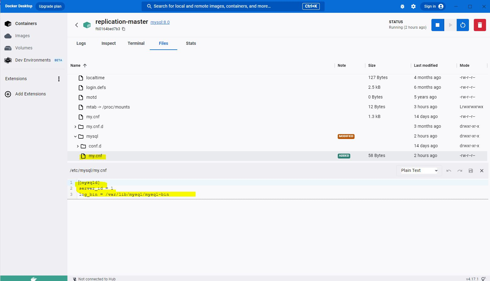
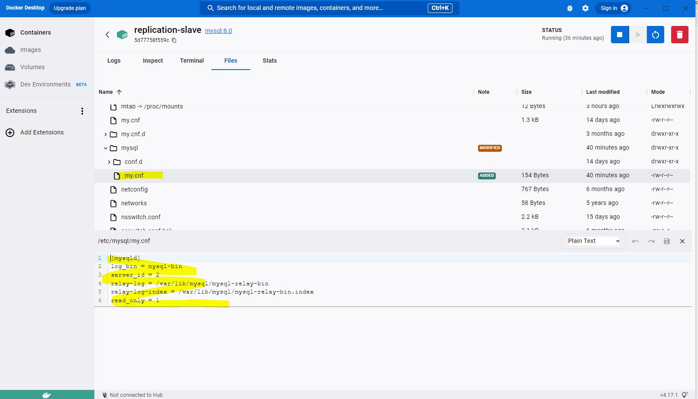
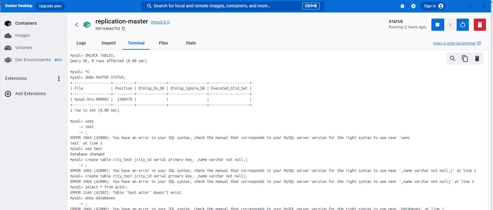
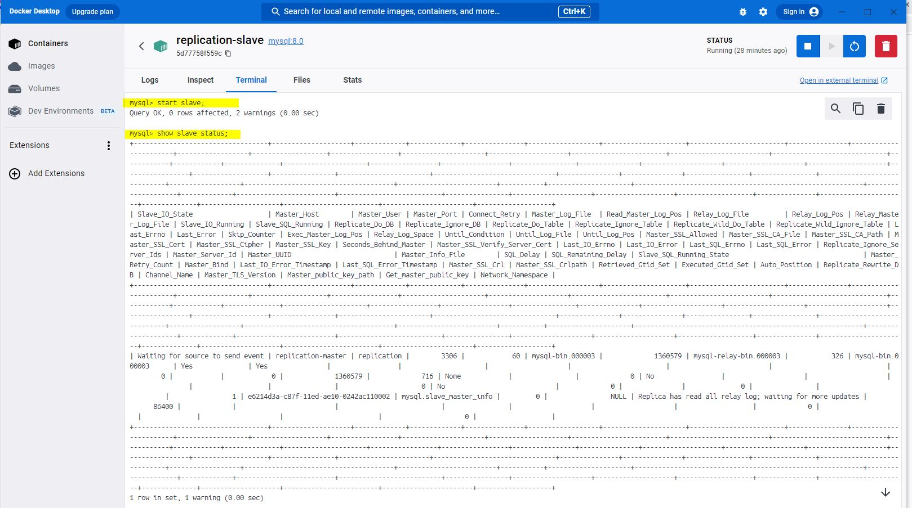
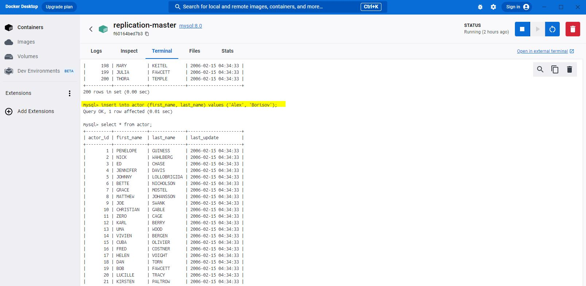
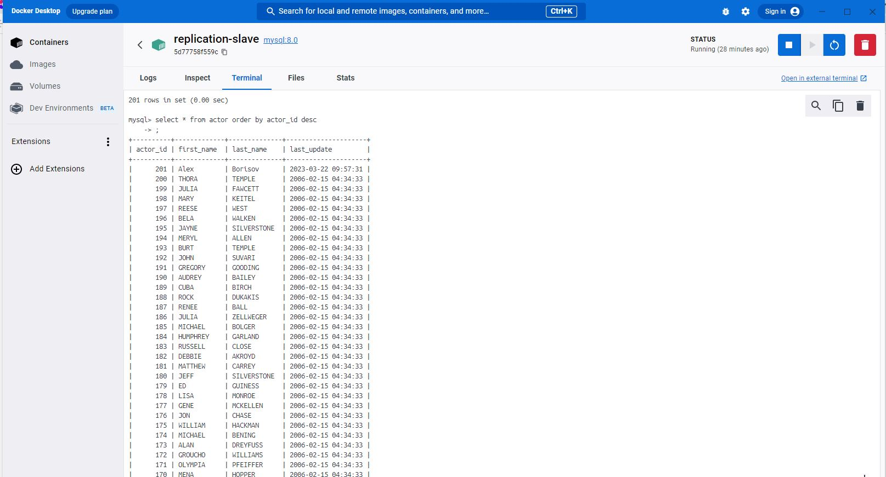

# ` Домашнее задание к занятию 12.6. «Репликация и масштабирование. Часть 1» - Борисов Александр`

## Задание 1 На лекции рассматривались режимы репликации На лекции рассматривались режимы репликации master-slave, master-master, опишите их различия., master-master, опишите их различия.

`В режиме master-slave данный изменются или записываются только в мастер. С слэйва может происходить только чтение данных. В master-master оба сервера выполняют функцийю мастера и слэйва одновременно. В таком случае мы повышаем эффективность при обращении к данным.`

## Задание 2 Выполните конфигурацию master-slave репликации, примером можно пользоваться из лекции.
### Приложите скриншоты конфигурации, выполнения работы: состояния и режимы работы серверов.

## Задание 3* Выполните конфигурацию master-master репликации. Произведите проверку.

Приложите скриншоты конфигурации, выполнения работы: состояния и режимы работы серверов.
